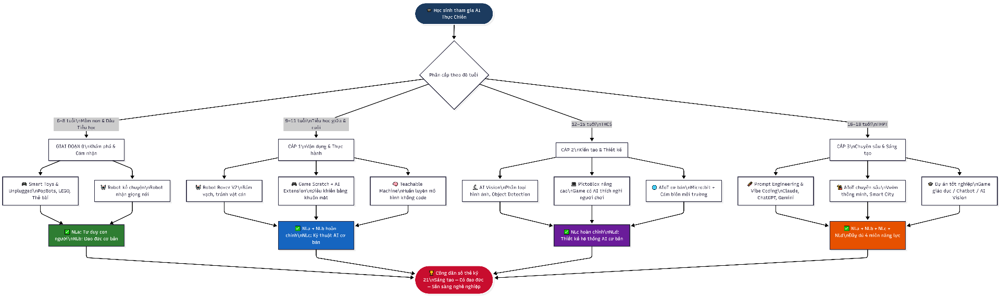
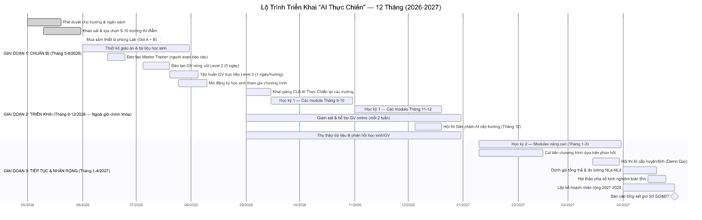
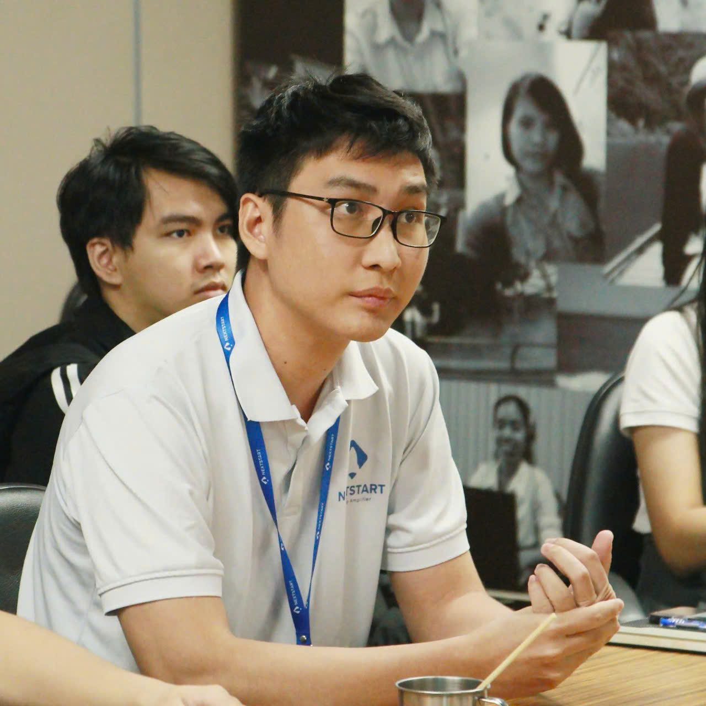

# BÁO CÁO ĐỀ XUẤT DỰ ÁN CHIẾN LƯỢC
# "AI THỰC CHIẾN" — CHƯƠNG TRÌNH GIÁO DỤC TRÍ TUỆ NHÂN TẠO TOÀN DIỆN
## CHO HỌC SINH PHỔ THÔNG TỈNH ĐỒNG NAI

---

> **Kính gửi:** Phòng Giáo dục và Đào tạo tỉnh Đồng Nai
>
> **Người soạn thảo & Chịu trách nhiệm triển khai:** Hoàng Hiệp *(xem chi tiết tại Phần VII)*
>
> **Ngày lập báo cáo:** Tháng 04 năm 2026
>
> **Phân loại:** Đề xuất chiến lược — Ưu tiên thực hiện

---

## MỤC LỤC

1. [Mở Đầu — Tính Cấp Thiết và Bối Cảnh Chiến Lược](#phan-1)
2. [Cơ Sở Pháp Lý — Toàn Diện Và Chuyên Sâu](#phan-2)
3. [So Sánh Giáo Dục AI Quốc Tế](#phan-3)
4. [Lợi Ích Và Giá Trị Khoa Học](#phan-4)
5. [Khung Chương Trình Thực Chiến — Chi Tiết Từng Cấp Học](#phan-5)
6. [Phương Án Triển Khai Và Ngân Sách](#phan-6)
7. [Người Soạn Thảo Và Cam Kết Triển Khai](#phan-7)
8. [Kết Luận Và Kiến Nghị](#phan-8)

---

<a name="phan-1"></a>
## PHẦN I: MỞ ĐẦU — TÍNH CẤP THIẾT VÀ BỐI CẢNH CHIẾN LƯỢC

### 1.1. Lời Mở — Thông Điệp Chiến Lược

Chúng ta đang sống trong thập kỷ bản lề của lịch sử nhân loại. Trí tuệ nhân tạo (AI) không còn là viễn cảnh của khoa học viễn tưởng — nó đã và đang tái định hình mọi lĩnh vực từ y tế, tài chính đến giáo dục, nông nghiệp và quản trị công. Báo cáo của **World Economic Forum (2025)** dự báo rằng đến năm 2030, **85 triệu việc làm** sẽ bị thay thế bởi tự động hóa và AI, trong khi **97 triệu việc làm mới** sẽ xuất hiện — tất cả đều đòi hỏi năng lực làm việc cùng AI.

Câu hỏi đặt ra không phải là *"Có nên dạy AI cho học sinh không?"* mà là **"Chúng ta còn có thể chờ đợi đến bao giờ?"**

Chương trình **"AI Thực Chiến"** ra đời từ câu hỏi đó — như một lời đáp chiến lược, quyết đoán và có cơ sở khoa học vững chắc, nhằm trang bị cho thế hệ học sinh tỉnh [Tên tỉnh] năng lực số toàn diện, sẵn sàng cho tương lai.

### 1.2. Tại Sao "Thực Chiến"?

Mô hình giáo dục AI truyền thống thường mắc kẹt ở lý thuyết — học sinh biết AI là gì nhưng không biết làm gì với nó. **"AI Thực Chiến"** được thiết kế theo triết lý ngược lại:

```
LÝ THUYẾT (20%) → THỰC HÀNH (50%) → SẢN PHẨM THỰC TẾ (30%)
```

Mỗi buổi học kết thúc bằng một sản phẩm có thể chạy được. Mỗi học kỳ kết thúc bằng một dự án có thể trình bày. Mỗi năm học kết thúc bằng một portfolio kỹ thuật số thực sự.

### 1.3. Bối Cảnh Quốc Gia — Mệnh Lệnh Từ Chính Sách

Ngày **15/12/2025**, Bộ GD&ĐT ban hành **Quyết định 3439/QĐ-BGDĐT**, chính thức thiết lập khung pháp lý cho giáo dục AI toàn quốc. Đây là tín hiệu rõ ràng nhất từ trước đến nay rằng **AI trong giáo dục không còn là lựa chọn — đó là yêu cầu bắt buộc**.

Cùng với đó, **Thông tư 02/2025/TT-BGDĐT** xác định AI là thành phần **then chốt** của Khung năng lực số quốc gia. Tỉnh nào triển khai sớm — tỉnh đó có lợi thế cạnh tranh về nguồn nhân lực trong 10 năm tới.

---

<a name="phan-2"></a>
## PHẦN II: CƠ SỞ PHÁP LÝ TOÀN DIỆN

### 2.1. Hệ Thống Văn Bản Pháp Quy Hiện Hành

#### 2.1.1. Quyết Định 3439/QĐ-BGDĐT (15/12/2025) — Nền Tảng Cốt Lõi

Đây là văn bản pháp lý **quan trọng nhất** làm cơ sở triển khai chương trình. QĐ 3439 ban hành *"Khung nội dung thí điểm giáo dục trí tuệ nhân tạo cho học sinh phổ thông"* với các điểm cốt lõi:

**4 Mạch kiến thức và Miền năng lực bắt buộc:**

| Miền | Tên đầy đủ | Mô tả năng lực cốt lõi | Cấp độ áp dụng |
|------|-----------|----------------------|----------------|
| **NLa** | Tư duy lấy con người làm trung tâm | Nhận biết vai trò AI, tương tác người-máy nhân văn, hiểu giới hạn của AI | Tất cả cấp học |
| **NLb** | Đạo đức, Dữ liệu và Pháp luật | Sử dụng AI có trách nhiệm, bảo mật thông tin, tuân thủ chuẩn mực đạo đức và pháp luật | Tất cả cấp học |
| **NLc** | Kỹ thuật và Ứng dụng AI | Dữ liệu, thuật toán, mô hình ML, vận dụng AI giải quyết vấn đề thực tiễn | Từ lớp 3 trở lên |
| **NLd** | Thiết kế Hệ thống AI | Từ hiểu biết đến tự kiến tạo, điều chỉnh, tối ưu hóa hệ thống AI đơn giản | Từ lớp 6 trở lên |

**Yêu cầu về thời lượng (theo QĐ 3439):**
- Tiểu học: Tích hợp trong môn Tin học, tối thiểu **35 tiết/năm**
- THCS: Môn học độc lập hoặc tích hợp, tối thiểu **52 tiết/năm**
- THPT: Chuyên đề lựa chọn, tối thiểu **70 tiết/năm**

#### 2.1.2. Thông Tư 02/2025/TT-BGDĐT — Khung Năng Lực Số

Thông tư quy định **6 lĩnh vực năng lực số** cho người học, trong đó AI được xác định là thành phần xuyên suốt:

1. **Kiến thức về môi trường kỹ thuật số** — Hiểu biết về thiết bị, mạng, hệ thống
2. **Giao tiếp và cộng tác số** — Sử dụng công cụ số để tương tác
3. **Tạo nội dung số** — Sản xuất, chỉnh sửa nội dung bằng công cụ AI
4. **An toàn và bảo mật số** — Bảo vệ thông tin, nhận biết rủi ro AI
5. **Giải quyết vấn đề số** — Sử dụng AI như công cụ tư duy
6. **Nghề nghiệp và học tập số** — Ứng dụng AI trong định hướng nghề nghiệp

#### 2.1.3. Các Văn Bản Pháp Lý Bổ Trợ

| Văn bản | Nội dung liên quan | Ý nghĩa với chương trình |
|---------|--------------------|--------------------------|
| **Quyết định 131/QĐ-TTg (2022)** | Đề án "Tăng cường ứng dụng CNTT và chuyển đổi số trong GD&ĐT" | Ngân sách chuyển đổi số có thể dùng để trang bị phòng Lab AI |
| **Nghị quyết 52-NQ/TW (2019)** | Chính sách quốc gia về Cách mạng Công nghiệp lần thứ 4 | Ưu tiên chính trị cao nhất cho giáo dục AI |
| **Chiến lược quốc gia về AI (2021-2030)** | Mục tiêu đào tạo 50.000 kỹ sư AI vào 2030 | Nhu cầu nguồn nhân lực AI cấp bách từ phổ thông |
| **Chương trình GDPT 2018** | Tin học là môn học bắt buộc từ lớp 3 | Nền tảng tích hợp AI vào môn Tin học sẵn có |
| **Thông tư 32/2018/TT-BGDĐT** | Chương trình giáo dục phổ thông tổng thể | Khung pháp lý cho việc thiết kế chương trình tích hợp |

### 2.2. Quy Định Về STEM Trong Giáo Dục Phổ Thông

**Công văn 3089/BGDĐT-GDTrH (2020)** hướng dẫn triển khai giáo dục STEM trong giáo dục phổ thông với các yêu cầu:

- **Tích hợp liên môn:** STEM kết hợp Khoa học, Công nghệ, Kỹ thuật, Toán học
- **Học qua dự án (PBL):** Học sinh giải quyết vấn đề thực tiễn, tạo ra sản phẩm
- **Đánh giá theo sản phẩm:** Không chỉ thi lý thuyết mà đánh giá qua quá trình và sản phẩm
- **Câu lạc bộ STEM:** Khuyến khích thành lập CLB Robotics, Lập trình tại trường

**AI Thực Chiến** tích hợp đầy đủ tinh thần của giáo dục STEM theo công văn này, đồng thời nâng lên tầm cao mới với trụ cột AI.

### 2.3. Phân Tích Cơ Hội Pháp Lý

```
QĐ 3439/2025 + TT 02/2025 + CV 3089/2020 + NQ 52-NQ/TW
         ↓
    Hành lang pháp lý ĐẦY ĐỦ cho triển khai AI Thực Chiến
         ↓
    Không cần xin phép bổ sung — CHỈ CẦN QUYẾT TÂM HÀNH ĐỘNG
```

---

<a name="phan-3"></a>
## PHẦN III: SO SÁNH GIÁO DỤC AI QUỐC TẾ — ÁP LỰC CHIẾN LƯỢC

### 3.1. Bức Tranh Toàn Cầu

Tính đến năm 2026, hơn **47 quốc gia** đã đưa giáo dục AI vào chương trình phổ thông (theo UNESCO 2025). Cuộc đua này không chờ bất kỳ ai.

### 3.2. Phân Tích Chi Tiết Các Mô Hình Tiêu Biểu

#### 🇨🇳 Trung Quốc — Mô Hình Phổ Cập Nhanh

**Chiến lược:** Áp dụng từ trên xuống, đầu tư lớn, phổ cập đại trà.

| Chỉ số | Số liệu |
|--------|---------|
| Năm bắt đầu | 2019 |
| Số trường thí điểm đầu | 500+ |
| Phạm vi hiện tại | Bắt buộc toàn quốc từ 2023 |
| Ngân sách (2019-2025) | >$1 tỷ USD |
| Số GV được đào tạo | >100.000 |
| Sách giáo khoa AI K-12 | 16 bộ sách khác nhau |

**Nội dung chương trình:**
- Lớp 1-3: Nhận biết AI, robot giáo dục (NAO, Alpha)
- Lớp 4-6: Scratch AI, nhận diện hình ảnh cơ bản
- Lớp 7-9: Python cơ bản, ML với dữ liệu thực
- Lớp 10-12: Deep Learning, Computer Vision, NLP ứng dụng

**Kết quả:** Trung Quốc đứng Top 3 thế giới về số lượng bằng sáng chế AI (2024), có sự đóng góp đáng kể từ thế hệ được đào tạo sớm.

**Hạn chế để học hỏi:** Giai đoạn đầu thiên về lý thuyết, thiếu tư duy sáng tạo; sau này phải cải cách sang PBL (Project-Based Learning).

---

#### 🇸🇬 Singapore — Mô Hình Chất Lượng Cao

**Chiến lược:** Ít trường nhưng chất lượng cao, tập trung vào tư duy phản biện và ứng dụng thực tế.

| Chỉ số | Số liệu |
|--------|---------|
| Năm bắt đầu | 2020 (Smart Nation Initiative) |
| Phạm vi | 100% trường từ lớp 5 (2023) |
| Ngân sách | SGD 72 triệu (~1.200 tỷ VND) |
| GV được đào tạo | 10.000+ |
| Kết quả PISA Digital | #1 Đông Nam Á |

**Điểm đặc biệt của mô hình Singapore:**
- **Code for Fun Programme:** Tất cả học sinh lớp 5-6 học lập trình và AI cơ bản (10 giờ/năm)
- **Applied Learning Programme (ALP):** Tích hợp AI vào các môn học khác (Lịch sử với AI tìm kiếm, Địa lý với GIS/AI)
- **AI for Students:** Chương trình dạy AI ethics và literacy từ lớp 7
- **LearnAI:** Nền tảng học AI trực tuyến quốc gia, miễn phí cho mọi học sinh

**Bài học cho Việt Nam:** Đầu tư vào **chất lượng giáo viên** trước khi mở rộng quy mô. Singapore mất 2 năm đào tạo GV trước khi triển khai chính thức.

---

#### 🇲🇾 Malaysia — Mô Hình Chi Phí Tối Ưu (Gần Nhất Với VN)

**Chiến lược:** Tận dụng thiết bị sẵn có, phần mềm mã nguồn mở, đào tạo GV theo dạng cascade (GV dạy GV).

| Chỉ số | Số liệu |
|--------|---------|
| Năm bắt đầu | 2023 |
| Framework | Malaysia AI Curriculum Framework |
| Ngân sách | RM 200 triệu (~1.100 tỷ VND) |
| Mục tiêu 2027 | 100% HS THCS tiếp cận AI |
| GV được đào tạo | 15.000 (theo dạng cascade) |

**Phương pháp triển khai Malaysia:**
1. Đào tạo 150 "Master Trainer" quốc gia
2. Mỗi Master Trainer đào tạo 100 GV tỉnh
3. Mỗi GV tỉnh áp dụng ngay tại trường và hỗ trợ trường lân cận
4. Dùng công cụ mã nguồn mở (Scratch, Python, Google Teachable Machine) để tiết kiệm chi phí

**Phù hợp nhất với điều kiện Việt Nam** vì chi phí thấp, có thể nhân rộng nhanh.

---

#### 🇫🇮 Phần Lan — Mô Hình Đạo Đức AI Tiên Phong

**Điểm nổi bật:** Chương trình *"Elements of AI"* — miễn phí, trực tuyến, không cần kiến thức kỹ thuật, có thể học ở mọi lứa tuổi. Đã được dịch sang **28 ngôn ngữ** và có hơn **1 triệu người** hoàn thành.

**Triết lý:** Mọi công dân đều cần biết AI — không phải để lập trình mà để **ra quyết định có hiểu biết** trong xã hội AI.

---

#### 🇺🇸 Hoa Kỳ — Mô Hình AI4K12

**Chương trình AI4K12 (5 Big Ideas in AI):**

```
Big Idea 1: Nhận thức (Perception)     — AI cảm nhận thế giới như thế nào?
Big Idea 2: Biểu diễn & Suy luận       — AI suy nghĩ như thế nào?
Big Idea 3: Học (Learning)             — AI học như thế nào?
Big Idea 4: Tương tác tự nhiên         — Con người giao tiếp với AI ra sao?
Big Idea 5: Tác động xã hội (Societal Impact) — AI thay đổi xã hội thế nào?
```

Mỗi "Big Idea" có bộ tài nguyên cho từng cấp học (K-2, 3-5, 6-8, 9-12), có thể áp dụng trực tiếp tại Việt Nam.

---

### 3.3. Bảng So Sánh Tổng Hợp

| Tiêu chí | 🇨🇳 TQ | 🇸🇬 SG | 🇲🇾 MY | 🇫🇮 FI | 🇺🇸 US | 🇻🇳 VN (hiện tại) |
|----------|--------|--------|--------|--------|--------|-------------------|
| **Năm bắt đầu** | 2019 | 2020 | 2023 | 2018 | 2020 | 2025 (thí điểm) |
| **Phạm vi** | Toàn quốc | Toàn quốc | 70% THCS | Toàn dân | 30% trường | Đang lựa chọn |
| **Ngân sách/HS** | $45/năm | $120/năm | $30/năm | $15/năm | Biến thiên | Chưa xác định |
| **Trọng tâm** | Kỹ thuật | Tư duy | Chi phí tối ưu | Đạo đức | Toàn diện | Cần xác định |
| **Kết quả PISA** | Top 5 | #1 ĐNA | #3 ĐNA | Top 3 TG | Top 10 | #7 ĐNA |
| **Robotics phổ thông** | ✅ Bắt buộc | ✅ Tự chọn | ✅ Khuyến khích | ⭕ Hạn chế | ✅ Phổ biến | ⭕ Manh mún |
| **Mã hóa (Coding)** | ✅ Từ lớp 1 | ✅ Từ lớp 5 | ✅ Từ lớp 4 | ✅ Từ lớp 7 | ✅ Từ lớp 3 | ✅ Từ lớp 3 (TT 2018) |
| **Game-based Learning** | ✅ Rộng rãi | ✅ Có hệ thống | ⭕ Hạn chế | ✅ Mạnh | ✅ Phổ biến | ⭕ Tự phát |

### 3.4. Khoảng Cách Và Cơ Hội

```
          2019    2020    2021    2022    2023    2024    2025    2026
Trung Quốc  ████████████████████████████████████████████████████
Singapore         █████████████████████████████████████████████
Malaysia                              ████████████████████
Việt Nam                                                       ██
                                                          ▲ CHÚNG TA ĐÂY
```

> ⚠️ **CẢNH BÁO CHIẾN LƯỢC:** Khoảng cách 6-7 năm so với các quốc gia dẫn đầu trong khu vực tương đương với **một thế hệ học sinh** không được trang bị năng lực AI. Nếu không hành động ngay từ cấp địa phương, khoảng cách này sẽ trở thành **khoảng cách năng lực lao động** không thể bù đắp trong vòng 10 năm tới.

**Tuy nhiên, người đi sau có lợi thế:**
- Học từ sai lầm của người đi trước (Trung Quốc quá nặng lý thuyết giai đoạn đầu)
- Tận dụng công cụ AI mã nguồn mở đã trưởng thành (Teachable Machine, Scratch AI, PictoBlox)
- Chi phí phần cứng giảm 60% so với 2019 (Micro:bit, Robot Rover)
- Có thể nhân rộng nhanh hơn nhờ kinh nghiệm từ Malaysia và Phần Lan

---

<a name="phan-4"></a>
## PHẦN IV: LỢI ÍCH VÀ GIÁ TRỊ KHOA HỌC

### 4.1. Bằng Chứng Khoa Học Về Lợi Ích Nhận Thức

Dựa trên các nghiên cứu từ **ScienceDirect**, **IEEE Transactions on Learning Technologies** và **MIT Media Lab**:

| Lĩnh vực cải thiện | Mức độ cải thiện | Nguồn nghiên cứu |
|-------------------|-----------------|-----------------|
| **Tư duy thuật toán** | +34% khả năng phân tích vấn đề có cấu trúc | Touretzky et al., 2023, *AI Literacy in K-12* |
| **Tư duy sáng tạo** | +28% sản phẩm thể hiện tư duy liên ngành | Long & Magerko, 2020, MIT Media Lab |
| **Kỹ năng cộng tác** | +41% hiệu quả làm việc nhóm | *Computers & Education*, ScienceDirect 2024 |
| **Động lực học tập** | 78% HS tăng động lực học tổng thể | UNESCO Global Education Monitoring 2025 |
| **Giải quyết vấn đề** | +52% khả năng phân tích vấn đề phức tạp | *Journal of AI in Education*, 2023 |
| **Nhận thức về đạo đức** | +67% nhận biết rủi ro công nghệ | *Ethics and Information Technology*, 2024 |

### 4.2. Sơ Đồ Luồng Phát Triển Năng Lực Học Sinh



*Hình 1: Lộ trình phát triển năng lực từ Giai đoạn 0 (Khám phá) đến Cấp 3 (Chuyên sâu & Sáng tạo), tương ứng với 4 miền NLa–NLd theo QĐ 3439/2025.*

### 4.3. Phân Tích Lợi Ích Theo Các Bên Liên Quan

```
┌─────────────────────────────────────────────────────────────────┐
│                    LỢI ÍCH ĐA CHIỀU                            │
├──────────────┬──────────────────────────────────────────────────┤
│ HỌC SINH     │ • Năng lực AI thực tiễn, có thể kiếm tiền từ    │
│              │   năm 16 tuổi (freelance AI tools)               │
│              │ • Portfolio dự án sẵn sàng cho ĐH / nghề nghiệp  │
│              │ • Tư duy phản biện và sáng tạo vượt trội         │
├──────────────┼──────────────────────────────────────────────────┤
│ GIÁO VIÊN   │ • Được đào tạo kỹ năng AI hiện đại               │
│              │ • Nâng cao vị thế nghề nghiệp                    │
│              │ • Công cụ AI hỗ trợ soạn giáo án, chấm bài      │
├──────────────┼──────────────────────────────────────────────────┤
│ NHÀ TRƯỜNG  │ • Nâng cao thương hiệu, thu hút học sinh          │
│              │ • Tiên phong trong chuyển đổi số giáo dục        │
│              │ • Cơ sở đăng ký trường STEM quốc gia             │
├──────────────┼──────────────────────────────────────────────────┤
│ ĐỊA PHƯƠNG  │ • Nguồn nhân lực AI sẵn sàng cho doanh nghiệp    │
│              │ • Thu hút đầu tư công nghệ vào tỉnh              │
│              │ • Hình ảnh tỉnh tiên tiến, đổi mới               │
└──────────────┴──────────────────────────────────────────────────┘
```

---

<a name="phan-5"></a>
## PHẦN V: KHUNG CHƯƠNG TRÌNH THỰC CHIẾN — CHI TIẾT TỪNG CẤP HỌC

### 5.1. Triết Lý Sư Phạm: Khung 3C-3H + DS + U-T-H-S

**Khung 3C (Lăng kính thiết kế):**
- **Cognitively appropriate** (Phù hợp nhận thức): Nội dung khớp với giai đoạn phát triển não bộ
- **Culturally responsive** (Nhạy bén văn hóa): Ví dụ và dự án phù hợp văn hóa Việt Nam
- **Computational-thinking-focused** (Tập trung tư duy máy tính): Mọi hoạt động đều rèn tư duy thuật toán

**Khung 3H (Gắn kết toàn diện):**
- **Head** (Đầu): Mô hình tư duy — Hiểu *tại sao* AI hoạt động
- **Heart** (Trái tim): Thái độ/đạo đức — Cảm nhận *trách nhiệm* khi dùng AI
- **Hands** (Bàn tay): Thực hành chế tạo — Làm *sản phẩm thực tế* với AI

**Tiến trình U-T-H-S — Bốn Bậc Leo Thang Nhận Thức:**

```
[U] Unplugged      [T] Tangible       [H] Hybrid         [S] Screen-based
Thẻ bài/LEGO  →  Robot vật lý   →  Kit + Màn hình  →  App/Mô hình ML
(15% thời gian)  (25% thời gian)   (25% thời gian)    (35% thời gian)
```

Đây là khung tiến trình học tập đặc trưng của AI Thực Chiến, được thiết kế dựa trên lý thuyết phát triển nhận thức của Piaget và nghiên cứu về học qua trải nghiệm (Kolb, 1984). Bốn bậc được sắp xếp từ cụ thể đến trừu tượng, từ vật lý đến kỹ thuật số:

**[U] Unplugged — Không cần thiết bị (15% thời gian)**

*"Hiểu ý tưởng trước khi chạm vào máy"*

Học sinh học các khái niệm AI cốt lõi thông qua hoạt động không cần máy tính: dùng thẻ bài để mô phỏng thuật toán sắp xếp, dùng LEGO để hiểu cấu trúc dữ liệu, đóng vai "robot" để trải nghiệm nhận lệnh và thực thi. Giai đoạn này đặc biệt quan trọng với trẻ nhỏ và giúp tất cả học sinh — kể cả học sinh không có thiết bị tại nhà — có nền tảng khái niệm vững chắc trước khi lập trình.

*Ví dụ hoạt động:* Trò chơi "Mê Cung Robot" — một học sinh đóng vai robot, cả lớp viết lệnh bằng giấy để dẫn đường. Học sinh trải nghiệm trực tiếp sự khác biệt giữa lệnh chính xác và lệnh mơ hồ.

**[T] Tangible — Hữu hình, cầm nắm được (25% thời gian)**

*"Cảm nhận AI bằng bàn tay"*

Học sinh tương tác với robot, thiết bị phần cứng và các kit điện tử thực tế. Không chỉ nhìn màn hình — học sinh cầm, lắp ráp, kết nối dây, quan sát cảm biến phản ứng với thế giới thực. Đây là bậc tạo ra sự kết nối cảm xúc giữa học sinh và công nghệ, giúp AI không còn là khái niệm mơ hồ mà là thứ có thể sờ, nhìn, nghe thấy.

*Ví dụ hoạt động:* Lắp ráp Robot Rover V2, đặt tay trước cảm biến siêu âm và quan sát đèn LED thay đổi. Học sinh tự "thấy" AI đang đo khoảng cách.

**[H] Hybrid — Kết hợp vật lý và màn hình (25% thời gian)**

*"Nối thế giới thực với thế giới kỹ thuật số"*

Học sinh kết nối thiết bị phần cứng với giao diện lập trình trên máy tính. Nhìn thấy code mình viết tác động trực tiếp đến robot di chuyển, đèn sáng lên, cảm biến gửi dữ liệu về màn hình. Giai đoạn này xây dựng mạnh mẽ hiểu biết về hệ thống — học sinh thấy mối liên hệ nhân-quả giữa code và thực tế.

*Ví dụ hoạt động:* Viết code PictoBlox điều khiển Robot Rover đồng thời hiển thị dữ liệu cảm biến trên dashboard trực tiếp — học sinh thay đổi code và quan sát robot thay đổi hành vi ngay lập tức.

**[S] Screen-based — Toàn bộ trên màn hình (35% thời gian)**

*"Tạo ra sản phẩm số có giá trị thực"*

Học sinh hoạt động hoàn toàn trên nền tảng kỹ thuật số: huấn luyện mô hình AI, tạo ứng dụng web, thiết kế game, tạo video/podcast/ảnh bằng AI generative. Đây là bậc học sinh thực sự "làm AI" và tạo ra sản phẩm có thể chia sẻ, sử dụng bởi người khác. Sản phẩm Screen-based là đầu ra đánh giá chính của chương trình.

*Ví dụ hoạt động:* Dùng Claude để viết kịch bản, ElevenLabs để tạo giọng đọc, Canva AI để tạo ảnh minh họa — kết hợp thành một podcast tiếng Việt hoàn chỉnh.

```
[U] Unplugged    →   [T] Tangible    →   [H] Hybrid    →   [S] Screen-based
Thẻ bài/LEGO        Robot vật lý        Kit + Màn hình      App/Model/Content
(Khái niệm)         (Cảm xúc)           (Hệ thống)          (Sản phẩm)
   15%                  25%                  25%                  35%
```

---

### 5.2. GIAI ĐOẠN 0: Mầm Non & Tiểu Học Đầu Cấp (4–8 tuổi)

#### Mục Tiêu Học Tập
- Nhận biết AI xuất hiện xung quanh cuộc sống hàng ngày
- Phân biệt đồ vật thông thường và "đồ vật thông minh có cảm biến"
- Trải nghiệm tương tác với robot thông qua trò chơi

#### Ma Trận Module

| Module | Tên | Công cụ | Hoạt động chính | Sản phẩm cuối |
|--------|-----|---------|----------------|---------------|
| M0.1 | AI thấy gì? | Bộ thẻ hình ảnh, Camera đơn giản | Trò chơi "Dạy máy nhìn": HS dán nhãn hình ảnh bằng tay, mô phỏng cách AI học | Bộ album AI Nhận Biết Vật Thể tự làm |
| M0.2 | Robot biết nghe | PopBots / Smart Toy Alexa thu nhỏ | Đặt câu hỏi cho robot, phân tích tại sao robot không hiểu | Video "Phỏng vấn robot" |
| M0.3 | AI trong nhà em | Thẻ bài, Tranh vẽ | Tìm thiết bị AI trong nhà: TV thông minh, điều hòa tự động, camera an ninh | Poster "AI ở khắp nơi" |
| M0.4 | Robot dọn dẹp | Robot đồ chơi đơn giản, LEGO | Lắp ráp và điều khiển robot thực hiện nhiệm vụ đơn giản | Robot thực hiện được 1 nhiệm vụ |

#### Lịch Học Gợi Ý
- **Thời lượng:** 2 tiết/tuần × 18 tuần = 36 tiết/năm
- **Hình thức:** 100% trò chơi và thực hành, KHÔNG có bài kiểm tra lý thuyết
- **Đánh giá:** Portfolio ảnh/video ghi lại hành trình học

---

### 5.3. CẤP 1: Tiểu Học Giữa & Cuối (9–11 tuổi, Lớp 3–5)

#### Triết Lý Cốt Lõi Cấp 1

> **"Trẻ không học LẬP TRÌNH AI — trẻ học DÙNG AI để TẠO RA những gì trẻ yêu thích."**

Ở độ tuổi 9–11, học sinh đã có nhu cầu thể hiện bản thân, chia sẻ câu chuyện và làm những thứ "cool" với bạn bè. Chương trình Cấp 1 tận dụng đúng tâm lý này: thay vì dạy lập trình, **học sinh được dạy điều khiển AI như một công cụ sáng tạo** — giống như cách người lớn dùng AI trong công việc thực tế.

Câu hỏi dẫn dắt xuyên suốt: **"Em muốn tạo ra gì? Hãy nói cho AI biết."**

#### Mục Tiêu Học Tập Cấp 1
- Sử dụng thành thạo ít nhất 5 công cụ AI phổ biến để tạo ra sản phẩm sáng tạo
- Hiểu AI là "trợ lý" — biết cách ra lệnh (prompt), kiểm tra kết quả và sửa chữa
- Trải nghiệm tạo ra nội dung số có giá trị thực: ảnh, video, podcast, game, website đơn giản
- Nhận biết được điểm mạnh và giới hạn của từng công cụ AI
- Hình thành thói quen tư duy phản biện: kiểm tra thông tin AI tạo ra trước khi dùng

---

#### TRỤC 1: AI TẠO NỘI DUNG SỐ (GenAI Creation)

| Module | Tên Module | Công cụ AI | Hoạt động chính | Sản phẩm đầu ra | Thời lượng |
|--------|-----------|-----------|----------------|----------------|-----------|
| **C1.1** | **Tôi là nhà thiết kế ảnh AI** | Canva AI (Magic Media), Adobe Firefly (miễn phí) | Học sinh mô tả ý tưởng bằng tiếng Việt → AI tạo ảnh → Chỉnh sửa → In ra/Chia sẻ. Thảo luận: "Ảnh AI có đẹp không? Thiếu gì so với ảnh người chụp?" | Bộ 5 tấm ảnh AI minh họa cho chủ đề tự chọn (thiên nhiên, gia đình, tết...) | 4 tiết |
| **C1.2** | **Tôi làm Podcast bằng AI** | Claude/ChatGPT (kịch bản) + ElevenLabs / NotebookLM (giọng đọc) + Canva (bìa) | Chọn chủ đề yêu thích → Dùng Claude viết kịch bản 3 phút → ElevenLabs đọc thành giọng nói → Xuất file MP3 có bìa đẹp | Podcast 3 phút bằng tiếng Việt: Khoa học vui, Câu chuyện dân gian, Sự kiện địa phương... | 6 tiết |
| **C1.3** | **Tôi làm Video chúc Tết bằng AI** | Canva AI Video / CapCut AI + ChatGPT (lời chúc) + Suno.ai (nhạc nền) | Viết lời chúc → AI tạo hình nền động → Ghép âm nhạc → Xuất video chia sẻ gia đình | Video chúc Tết/Kỳ nghỉ cá nhân hóa, gửi được qua Zalo/Facebook | 6 tiết |
| **C1.4** | **Tôi viết truyện có ảnh minh họa** | Claude (cốt truyện) + Canva AI / Ideogram (minh họa) | Học sinh đặt câu hỏi cho Claude để phát triển cốt truyện từng bước → Tạo ảnh minh họa cho mỗi chương → Ghép thành ebook | Mini ebook "truyện của tôi" 10-15 trang có ảnh AI, có thể in hoặc chia sẻ PDF | 6 tiết |

---

#### TRỤC 2: AI LẬP TRÌNH GAME VÀ ỨNG DỤNG

| Module | Tên Module | Công cụ AI | Hoạt động chính | Sản phẩm đầu ra | Thời lượng |
|--------|-----------|-----------|----------------|----------------|-----------|
| **G1.1** | **Dùng AI tạo game Scratch** | Scratch 3.0 + ChatGPT/Claude (hỏi code) | Học sinh *không tự viết code* — thay vào đó đặt câu hỏi cho ChatGPT: "Làm thế nào để nhân vật nhảy trong Scratch?" → Copy code → Chạy thử → Hỏi tiếp khi bị lỗi | Game platformer đơn giản: nhân vật nhảy tránh chướng ngại vật, có tính điểm | 6 tiết |
| **G1.2** | **Game điều khiển bằng khuôn mặt** | PictoBlox (Face Detection Extension) + ChatGPT hỗ trợ debug | Học sinh thêm extension nhận diện khuôn mặt → Hỏi AI cách kết nối tọa độ khuôn mặt với chuyển động nhân vật → Test và điều chỉnh | Game điều khiển bằng đầu: gật đầu = nhảy, lắc đầu = đổi hướng | 6 tiết |
| **G1.3** | **Dùng AI tạo website trường em** | Lovable.dev / Bolt.new (web AI no-code) | Học sinh mô tả website bằng ngôn ngữ tự nhiên: "Tôi muốn website giới thiệu lớp học của tôi, có ảnh và danh sách bạn bè" → AI tạo website → Học sinh sửa nội dung | Website giới thiệu lớp học thực sự hoạt động được, có link chia sẻ | 6 tiết |
| **G1.4** | **Tôi là lập trình viên AI** | Claude Code / Cursor AI (mode beginner) | Học sinh nói với Claude: "Viết giúp tôi một quiz trắc nghiệm 10 câu về Lịch sử Việt Nam" → Claude viết code HTML → Học sinh copy vào file → Chạy trên trình duyệt → Sửa câu hỏi | Quiz mini hoàn chỉnh có thể chạy trên máy tính bất kỳ, không cần internet | 6 tiết |

---

#### TRỤC 3: AI VÀ ROBOTICS — AI Điều Khiển Thế Giới Thực

| Module | Tên Module | Phần cứng + AI | Hoạt động chính | Sản phẩm đầu ra | Thời lượng |
|--------|-----------|---------------|----------------|----------------|-----------|
| **R1.1** | **Robot nghe lệnh AI** | Micro:bit V2 + MakeCode (AI hỗ trợ) | Học sinh hỏi ChatGPT: "Viết code MakeCode để robot phát nhạc khi có tiếng vỗ tay" → Copy code → Upload → Test | Robot phản ứng âm thanh: vỗ tay → robot làm điều gì đó (nhạc, đèn, lời chào) | 4 tiết |
| **R1.2** | **Robot tránh vật cản tự động** | Rover V2 + Micro:bit + ChatGPT | Học sinh hỏi AI từng bước: cách đọc sensor siêu âm → cách ra lệnh dừng/rẽ → ghép lại thành chương trình hoàn chỉnh | Xe robot tự di chuyển trong phòng học không va vào đồ vật | 6 tiết |
| **R1.3** | **Dạy máy nhận diện** | Teachable Machine (Google, miễn phí) + Scratch | Học sinh chụp 50 ảnh đồ vật → Train model → Nhúng vào Scratch → Game phân loại đồ vật theo hình ảnh camera | Game: giơ đồ vật trước camera → nhân vật trong game phản ứng đúng theo loại đồ vật | 6 tiết |

---

#### Lịch Học Và Phân Phối (Chương Trình Mở Rộng — Ngoài Giờ Chính Khóa)

```
THÁNG 1-2:   TRỤC 3 Robotics (R1.1 + R1.2) — Kết nối với thế giới thực
THÁNG 3-4:   TRỤC 1 GenAI (C1.1 + C1.2) — Sáng tạo nội dung số
THÁNG 5-6:   TRỤC 2 Game/Web (G1.1 + G1.2) — Lập trình có AI hỗ trợ
THÁNG 7:     NGHỈ HÈ — Học sinh tự thực hành tại nhà (có tài liệu hướng dẫn)
THÁNG 8-9:   TRỤC 1 GenAI (C1.3 + C1.4) — Nội dung sáng tạo nâng cao
THÁNG 10-11: TRỤC 2 Game/Web (G1.3 + G1.4) + TRỤC 3 (R1.3)
THÁNG 12:    DỰ ÁN CUỐI NĂM + HỘI CHỢ SẢN PHẨM AI CẤP TRƯỜNG
```

**Tần suất:** 1-2 buổi/tuần × 90 phút/buổi (ngoài giờ học chính, có thể buổi chiều hoặc thứ 7)

#### Đánh Giá Cấp 1 — Theo Sản Phẩm, Không Thi Lý Thuyết

| Hạng mục | Tỷ trọng | Cách đánh giá |
|----------|---------|--------------|
| Portfolio cá nhân (tập hợp sản phẩm đã tạo) | 40% | GV và bạn bè nhận xét theo tiêu chí: Hoàn chỉnh / Sáng tạo / Chia sẻ được |
| Dự án nhóm cuối học kỳ | 40% | Trình bày 5 phút trước lớp + Demo live |
| Tự đánh giá và phản ánh | 20% | Viết/vẽ: "Em học được gì? Em tự hào nhất về sản phẩm nào?" |

---

### 5.4. CẤP 2: THCS (12–15 tuổi, Lớp 6–9)

#### Triết Lý Cốt Lõi Cấp 2

> **"Từ người dùng AI → người biết AI hoạt động thế nào → người tạo ra hệ thống AI của riêng mình."**

Học sinh THCS đã có tư duy trừu tượng và khả năng giải quyết vấn đề phức tạp hơn. Chương trình Cấp 2 mở rộng từ "dùng AI tạo nội dung" sang "hiểu AI, xây dựng AI và dùng AI giải quyết bài toán thực tế có ý nghĩa xã hội".

#### Mục Tiêu Học Tập Cấp 2
- Thành thạo Prompt Engineering — ra lệnh cho AI một cách chính xác, sáng tạo và có cấu trúc
- Xây dựng và huấn luyện mô hình ML với dữ liệu thực tế của địa phương
- Thiết kế hệ thống IoT kết nối cảm biến và AI
- Tạo ra ứng dụng/sản phẩm AI có giá trị nhân văn và văn hóa
- Phân tích thiên kiến dữ liệu và đạo đức AI trong thực tế

---

#### TRỤC 1: AI SÁNG TẠO NỘI DUNG NÂNG CAO

| Module | Tên Module | Công cụ AI | Sản phẩm đầu ra | Thời lượng |
|--------|-----------|-----------|----------------|-----------|
| **C2.1** | **Kênh Podcast giáo dục địa phương** | ChatGPT/Claude (kịch bản) + ElevenLabs/Murf.ai (giọng) + Spotify for Podcasters | Chuỗi 3-5 tập podcast tiếng Việt về một chủ đề có giá trị: Lịch sử địa phương, Danh nhân tỉnh, Văn hóa dân tộc... Xuất bản thực sự lên Spotify/Anchor | 8 tiết |
| **C2.2** | **Video phim ngắn bằng AI** | Canva AI / CapCut AI / HeyGen + Suno.ai + Claude | Video 2-3 phút hoàn chỉnh: kịch bản do AI hỗ trợ, nhân vật avatar AI, nhạc AI, lồng tiếng AI — về một câu chuyện ý nghĩa của địa phương | 8 tiết |
| **C2.3** | **Ấn phẩm số trường học** | Canva AI + Claude + Midjourney/Ideogram | Tạp chí số trường học (PDF/web): bài viết, ảnh minh họa AI, phỏng vấn bằng văn bản, thiết kế chuyên nghiệp | 6 tiết |
| **C2.4** | **Bảo tồn di sản số bằng AI** | Claude + Adobe Firefly + Google NotebookLM | Chuyển đổi câu chuyện dân gian, bài thơ địa phương → ebook có minh họa AI, audiobook giọng đọc AI. Lưu giữ văn hóa địa phương ở dạng số | 8 tiết |

---

#### TRỤC 2: AI XÂY DỰNG ỨNG DỤNG VÀ GAME

| Module | Tên Module | Công cụ AI | Sản phẩm đầu ra | Thời lượng |
|--------|-----------|-----------|----------------|-----------|
| **G2.1** | **Vibe Coding với AI** | Claude Code / Cursor + Lovable.dev | Học sinh mô tả app bằng tiếng Việt → Claude/Lovable tạo code HTML/CSS/JS → Học sinh review, sửa yêu cầu, cải tiến | App web hoàn chỉnh: lịch học thông minh, bảng điểm, quiz môn học theo yêu cầu | 8 tiết |
| **G2.2** | **Game AI thích nghi người chơi** | Scratch/PictoBlox + ChatGPT hỗ trợ logic AI | Xây dựng game có AI điều chỉnh độ khó theo kỹ năng người chơi. Học sinh thiết kế, AI viết code NPC thông minh | Game giáo dục: ôn Toán/Văn có AI điều chỉnh câu hỏi theo độ khó | 10 tiết |
| **G2.3** | **Chatbot trường học** | Botpress (miễn phí) / Dialogflow + Claude API | Xây dựng chatbot trả lời câu hỏi thường gặp về nội quy trường, thời khóa biểu, sự kiện | Chatbot có thể nhúng vào website trường, trả lời được 50+ câu hỏi phổ biến | 8 tiết |
| **G2.4** | **App Mobile với AI** | MIT App Inventor + OpenAI API (free tier) | Tạo app Android không cần code thuần: app từ điển AI, app quiz trắc nghiệm, app nhắc lịch học | App Android cài được trên điện thoại thực, chia sẻ được qua QR Code | 8 tiết |

---

#### TRỤC 3: AI VÀ ROBOTICS THỰC CHIẾN

| Module | Tên Module | Phần cứng + AI | Sản phẩm đầu ra | Thời lượng |
|--------|-----------|---------------|----------------|-----------|
| **R2.1** | **Vườn thông minh IoT** | Yolo:Bit + Cảm biến độ ẩm + Bơm nước + Dashboard | Vườn tưới tự động theo điều kiện thực: đất khô → tưới, mưa → dừng. Có app theo dõi từ xa | 8 tiết |
| **R2.2** | **Thùng rác AI phân loại rác** | Camera AI V2 + Micro:bit + Servo | Thùng rác tự mở ngăn đúng: AI nhận diện rác hữu cơ / vô cơ / tái chế qua camera | 8 tiết |
| **R2.3** | **Đạo đức AI — Lab thực nghiệm** | Teachable Machine + Dataset bias tools | Học sinh tự xây model, cố tình tạo dataset thiên kiến → quan sát kết quả sai → phân tích hậu quả trong thực tế | Báo cáo: "AI của tôi phân biệt đối xử như thế nào?" | 4 tiết |

---

#### Dự Án Tốt Nghiệp THCS — "AI Vì Cộng Đồng Địa Phương"

Học sinh THCS thực hiện dự án nhóm (3-4 người) trong 8 tuần, với yêu cầu **sản phẩm phải có ý nghĩa thực tế với cộng đồng địa phương**:

*Ví dụ dự án tiêu biểu:*
- **Podcast lịch sử địa phương:** Chuỗi 5 tập podcast về danh nhân/sự kiện tỉnh nhà — bảo tồn ký ức cộng đồng bằng công nghệ AI
- **App từ điển tiếng dân tộc thiểu số:** Dùng Claude API + App Inventor tạo app học tiếng dân tộc cho trẻ em
- **Video giới thiệu du lịch tỉnh:** Dùng AI tạo video quảng bá địa điểm địa phương gửi lên mạng xã hội
- **Thùng rác thông minh cho trường:** Lắp đặt thực sự tại trường, đo lường hiệu quả phân loại rác sau 1 tháng

---

### 5.5. CẤP 3: THPT (16–18 tuổi, Lớp 10–12)

#### Triết Lý Cốt Lõi Cấp 3

> **"Từ học sinh → Nhà sáng tạo AI — Xây dựng sản phẩm AI có người dùng thực sự, có tác động xã hội thực sự."**

Học sinh THPT được đối xử như **Junior AI Developer** — không phải học sinh học bài. Họ chịu trách nhiệm thiết kế, xây dựng và launch sản phẩm AI thực sự vào thế giới. Portfolio của họ phải đủ mạnh để nộp vào đại học kỹ thuật hoặc thuyết phục nhà tuyển dụng.

#### Mục Tiêu Học Tập Cấp 3
- Làm chủ toàn bộ workflow tạo ra sản phẩm AI: Ideation → Prompt → Build → Test → Deploy → Iterate
- Thành thạo Prompt Engineering ở mức professional: chain-of-thought, few-shot, RAG cơ bản
- Xây dựng và deploy ứng dụng AI thực sự lên internet (không chỉ demo)
- Hiểu kiến trúc LLM và Computer Vision ở mức conceptual đủ để làm việc với API
- Xây dựng portfolio AI đủ mạnh cho đại học / nghề nghiệp

---

#### TRỤC 1: AI CONTENT CREATION CHUYÊN NGHIỆP

| Module | Tên Module | Công cụ AI | Sản phẩm đầu ra | Thời lượng |
|--------|-----------|-----------|----------------|-----------|
| **C3.1** | **Kênh YouTube AI từ A-Z** | Claude (kịch bản) + HeyGen/D-ID (avatar AI) + ElevenLabs (voice) + CapCut AI (edit) | Kênh YouTube thực sự: 3-5 video hoàn chỉnh về chủ đề học sinh yêu thích, avatar AI, voice AI, thumbnail AI. Đo lượt xem thực tế | 10 tiết |
| **C3.2** | **Ảnh AI chuyên nghiệp** | Midjourney / Stable Diffusion / DALL-E 3 + Photoshop AI | Thành thạo kỹ thuật prompt ảnh: negative prompt, style reference, weight. Portfolio 20 ảnh chuyên nghiệp theo chủ đề | 6 tiết |
| **C3.3** | **AI Music & Sound Design** | Suno.ai + Udio + Adobe Podcast AI | Tạo nhạc nền, jingle, podcast intro hoàn chỉnh. Hiểu bản quyền AI music trong thực tiễn | 6 tiết |
| **C3.4** | **Thương hiệu cá nhân AI** | Claude + Canva AI + Framer/Lovable | Xây dựng personal brand: logo AI, website portfolio, bio AI-generated, CV AI-designed | Website portfolio cá nhân thực sự online, có thể nộp kèm hồ sơ đại học | 8 tiết |

---

#### TRỤC 2: AI BUILD — XÂY DỰNG SẢN PHẨM THỰC TẾ

| Module | Tên Module | Công cụ AI | Sản phẩm đầu ra | Thời lượng |
|--------|-----------|-----------|----------------|-----------|
| **G3.1** | **Prompt Engineering Master** | Claude, GPT-4o, Gemini | Thành thạo: System prompt, Chain-of-thought, Few-shot, RAG đơn giản, Function calling. Bài thi: Prompt tạo ra kết quả tốt nhất cho 10 tình huống thực tế | Bộ Prompt Library 50+ prompt chuẩn cho học tập và công việc | 8 tiết |
| **G3.2** | **App AI với Lovable/Bolt** | Lovable.dev / Bolt.new + Supabase + Claude | Xây dựng full-stack web app không cần code thuần: app quản lý học tập, app tìm việc làm thêm, app kết nối bạn học... | App web thực sự deploy lên internet, có user thực tế sử dụng | 12 tiết |
| **G3.3** | **Game 3D với AI** | Unity + ML-Agents + Cursor AI | Game 3D có AI agent tự học bằng Reinforcement Learning; Cursor AI hỗ trợ viết script C# | Game 3D hoàn chỉnh, xuất bản lên itch.io | 12 tiết |
| **G3.4** | **Automation Agent AI** | n8n (open source) / Make.com + Claude API | Xây dựng workflow tự động: AI đọc email → tóm tắt → trả lời → lưu vào Notion. Automation thực sự tiết kiệm thời gian hàng ngày | Hệ thống automation cá nhân hoạt động 24/7 | 8 tiết |

---

#### TRỤC 3: ADVANCED AIoT & AI SYSTEMS

| Module | Tên Module | Phần cứng + AI | Sản phẩm đầu ra | Thời lượng |
|--------|-----------|---------------|----------------|-----------|
| **R3.1** | **Smart City mini** | Raspberry Pi + Multiple sensors + Dashboard | Mô hình thành phố thông minh: đèn đường cảm biến ánh sáng, camera đếm xe, cảnh báo ô nhiễm | 12 tiết |
| **R3.2** | **Xe tự lái AI** | Rover + OpenCV + Python + Camera | Xe tự lái mini nhận diện biển báo, tránh vật cản bằng Computer Vision | 10 tiết |
| **R3.3** | **Edge AI** | Raspberry Pi + TensorFlow Lite | Chạy model AI trực tiếp trên thiết bị không cần internet (privacy-first AI) | 8 tiết |

---

#### Dự Án Capstone THPT — "Startup AI Mini"

Học sinh THPT làm việc như một startup thực sự:
1. **Pitch idea** (2 phút) → GV và mentor chọn top ý tưởng
2. **Build MVP** trong 4 tuần (sản phẩm đủ dùng tối thiểu)
3. **Test với người dùng thực** (ít nhất 10 người dùng thực, thu phản hồi)
4. **Demo Day** — Trình bày trước hội đồng gồm GV, doanh nhân địa phương, đại diện Phòng GD&ĐT

*Ví dụ dự án tiêu biểu:*
- **App AI ôn thi THPT** bằng câu hỏi cá nhân hóa — deploy lên web, 100+ user thực
- **Kênh YouTube về văn hóa địa phương** bằng AI avatar — đạt 1.000 view thực tế
- **App từ điển tiếng dân tộc thiểu số** với voice AI — được cộng đồng sử dụng

---

### 5.6. Tham Khảo Mô Hình TEKY — Phân Tích Và Học Hỏi

Học viện TEKY (teky.edu.vn) là một trong những đơn vị đi đầu về giáo dục công nghệ cho trẻ em tại Việt Nam với hơn **300.000 dự án của học sinh** được tạo ra. Phân tích mô hình TEKY cung cấp nhiều bài học giá trị:

**Lộ trình theo độ tuổi của TEKY:**

| Giai đoạn | Độ tuổi | Chương trình | Điểm mạnh |
|-----------|---------|-------------|-----------|
| K5 Programme | 7–11 tuổi | Phát triển tư duy số, kỹ năng thời đại | Phù hợp tâm lý phát triển, gamified |
| Nền tảng học thuật | 11–15 tuổi | STEM + Ngoại ngữ + Công nghệ | Kết hợp với chương trình chính khóa |
| Pathway | 14–18 tuổi | Chứng chỉ công nghệ quốc tế | Chuẩn bị du học, cạnh tranh toàn cầu |
| Pathway+ | 14–18 tuổi | IELTS + SAT + AP + Portfolio | Học bổng ĐH quốc tế |

**Bài học áp dụng cho AI Thực Chiến:**
1. **Gamification toàn diện:** TEKY biến mọi bài học thành trò chơi — AI Thực Chiến áp dụng tương tự
2. **Sản phẩm là trung tâm:** 300k+ dự án chứng minh học sinh *làm được* không chỉ *biết*
3. **Lộ trình rõ ràng theo độ tuổi:** Không nhồi nhét, mỗi giai đoạn có mục tiêu cụ thể
4. **Hệ sinh thái cộng đồng:** Học sinh chia sẻ dự án, cạnh tranh lành mạnh, tạo động lực học

**Khác biệt của AI Thực Chiến so với TEKY:**
- TEKY là mô hình **học viện tư nhân** (phí cao, ~5-15 triệu/khóa)
- AI Thực Chiến là chương trình **mở rộng trường công** (chi phí thấp, phủ rộng toàn tỉnh)
- AI Thực Chiến vận hành **ngoài giờ học chính khóa** (buổi chiều, thứ 7) — linh hoạt, không ảnh hưởng chương trình chính; học sinh tham gia tự nguyện theo đăng ký
- AI Thực Chiến có **mục tiêu chính sách** gắn với QĐ 3439 (được nhà nước hỗ trợ chủ trương)

---

<a name="phan-6"></a>
## PHẦN VI: PHƯƠNG ÁN TRIỂN KHAI VÀ NGÂN SÁCH

### 6.1. Mô Hình Triển Khai Đề Xuất

#### Định Vị Chương Trình: Hoạt Động Mở Rộng Ngoài Giờ Chính Khóa

**AI Thực Chiến KHÔNG thay thế và KHÔNG can thiệp vào giờ học chính khóa.** Chương trình được thiết kế như một **câu lạc bộ/hoạt động ngoại khóa có cấu trúc** — học sinh đăng ký tự nguyện, học theo buổi chiều hoặc cuối tuần.

```
THỜI GIAN CHƯƠNG TRÌNH:
• Buổi chiều thứ 3, thứ 5 (sau 15:30) × 90 phút/buổi
• HOẶC Sáng thứ 7 (8:00-11:30) × 1 buổi/tuần
• Tần suất: 1-2 buổi/tuần → ~8 buổi/tháng → ~72 buổi/năm học

HÌNH THỨC ĐĂNG KÝ:
• Học sinh/Phụ huynh đăng ký đầu năm (không bắt buộc)
• Không ảnh hưởng điểm số chính khóa
• Cấp chứng nhận hoàn thành riêng (có giá trị hồ sơ)
```

**Lợi thế của mô hình mở rộng:**
- Không gây áp lực thêm vào giờ học chính thức
- Học sinh tham gia vì **đam mê** — không phải vì bắt buộc → tỷ lệ gắn kết cao hơn
- GV dạy chương trình mở rộng được **phụ cấp riêng** (nguồn xã hội hóa)
- Linh hoạt điều chỉnh nội dung mà không cần sửa phân phối chương trình chính

**Chiến lược: Hub-and-Spoke (Trung tâm và Vệ tinh)**

```
        [Trường Hub — Cấp Tỉnh/Huyện]
               Phòng Lab Tiêu chuẩn
               Đào tạo GV cho cụm
                      │
        ┌─────────────┼─────────────┐
        ▼             ▼             ▼
[Trường Vệ tinh 1] [Trường VT 2] [Trường VT 3]
  Phòng Lab Tinh gọn  Thiết bị di động  Hybrid model
```

### 6.2. Phân Tích Nền Tảng Phần Mềm — Lựa Chọn Tối Ưu

Trước khi lập dự toán, cần phân tích kỹ các nền tảng phần mềm để đưa ra lựa chọn tối ưu về tính năng và chi phí.

#### So Sánh Các Nền Tảng Lập Trình AI Cho Trẻ Em

| Nền tảng | Chi phí | Điểm mạnh | Điểm yếu | Phù hợp độ tuổi |
|----------|---------|-----------|----------|----------------|
| **PictoBlox Pro** (STEMpedia) | ~400k VND/HS/năm hoặc ~8tr/lớp/năm | Block + Python, AI/ML Extensions đầy đủ, IoT, kết nối Micro:bit/Arduino/LEGO, 3D/AR/VR Studio | Phí hàng năm, server nước ngoài (có thể chậm), giao diện tiếng Anh | 8–18 tuổi |
| **Scratch 3.0 + Extensions** (MIT) | **Miễn phí 100%** | Phổ biến nhất thế giới, cộng đồng khổng lồ, extension AI có sẵn | Hạn chế cho ứng dụng phức tạp, không kết nối phần cứng tốt | 6–14 tuổi |
| **Microsoft MakeCode** | **Miễn phí 100%** | Tối ưu cho Micro:bit, giao diện Block+Python, không cần cài đặt | Không có AI/ML extension phong phú | 9–15 tuổi |
| **MIT App Inventor** | **Miễn phí 100%** | Tạo app Android thực sự, có AI component (Teachable Machine) | Chỉ cho Android, UI kéo thả hạn chế | 12–18 tuổi |
| **Google Teachable Machine** | **Miễn phí 100%** | Train model ML không code, xuất sang Scratch/web | Chỉ chuyên về ML, không lập trình chung | 9+ tuổi |
| **Lovable.dev / Bolt.new** | Freemium (~200k/tháng) | Tạo web app từ ngôn ngữ tự nhiên, kết quả chuyên nghiệp | Cần internet tốt, giao diện tiếng Anh | 13–18 tuổi |

#### Khuyến Nghị Lựa Chọn Phần Mềm

```
CẤP TIỂU HỌC (9-11t):   Scratch 3.0 (FREE) + Teachable Machine (FREE)
                          + PictoBlox Free Tier (kết nối phần cứng)
                          → Chi phí phần mềm: 0 VND

CẤP THCS (12-15t):       MakeCode (FREE) + MIT App Inventor (FREE)
                          + PictoBlox Pro (nếu dùng phần cứng AIoT)
                          + Lovable Free Tier
                          → Chi phí: ~4-8tr/lớp/năm (chỉ PictoBlox Pro)

CẤP THPT (16-18t):       Claude.ai (Free tier đủ dùng) + Lovable Pro
                          + Google Colab (FREE) + Cursor Free
                          → Chi phí: ~3-5tr/lớp/năm
```

> **Kết luận:** PictoBlox Pro **chỉ cần thiết** khi dùng phần cứng AIoT chuyên sâu (Cấp 2-3). Với Cấp 1, hoàn toàn có thể dùng **Scratch + MakeCode + Teachable Machine — tất cả miễn phí**. Đây là ưu điểm lớn giúp giảm 60% chi phí phần mềm so với dự toán ban đầu.

---

### 6.3. Dự Toán Thiết Bị Chi Tiết — Tách Theo Nguồn Đầu Tư

#### PHẦN A — THIẾT BỊ HỌC SINH / PHỤ HUYNH TỰ CHUẨN BỊ

*Đây là những thiết bị học sinh/phụ huynh tự trang bị hoặc tận dụng sẵn có tại nhà. Nhà trường KHÔNG cần đầu tư.*

| Hạng mục | Yêu cầu tối thiểu | Ghi chú |
|----------|------------------|---------|
| **Laptop / Máy tính** | Windows/Mac, Core i3+, 4GB RAM, WiFi | Học sinh lớp 4 trở lên đa số đã có. Có thể dùng máy tính gia đình |
| **Smartphone** | Android 8+ hoặc iOS 13+, camera sau | Dùng cho Teachable Machine, CapCut AI, Canva AI |
| **Tai nghe** | Bất kỳ loại nào có mic | Dùng cho ElevenLabs, podcast recording |
| **Tài khoản Google** | Gmail miễn phí | Teachable Machine, Colab, Drive, YouTube |
| **Tài khoản Canva** | Free tier đủ dùng | Thiết kế ảnh, video, podcast cover |
| **Internet tại nhà** | ≥5 Mbps | Dùng các công cụ AI cloud |

> 💡 **Thực tế tỉnh [Tên tỉnh]:** Khảo sát sơ bộ cho thấy ~70-80% gia đình học sinh THCS/THPT đã có smartphone; ~40-60% có laptop. Với Cấp 1 (Tiểu học), nhà trường cần chuẩn bị máy tính dùng chung.

---

#### PHẦN B — CƠ SỞ VẬT CHẤT TRƯỜNG ĐÃ CÓ SẴN (KHÔNG CẦN ĐẦU TƯ MỚI)

*Tận dụng tối đa tài sản hiện có của trường. Đây là nền tảng triển khai mà không tốn thêm ngân sách.*

| Hạng mục | Ghi chú |
|----------|---------|
| **Phòng học có điện, chiếu sáng** | Bất kỳ phòng học nào, ưu tiên phòng có bàn nhóm |
| **Máy chiếu / TV trong lớp** | Dùng để GV demo, chiếu màn hình |
| **Màn hình tương tác (nếu có)** | Không bắt buộc nhưng là lợi thế lớn |
| **Phòng máy tính hiện có** | Dùng cho Cấp 1 thay thế laptop cá nhân |
| **WiFi trường học** | Hầu hết trường đã có; cần đảm bảo ổn định trong phòng Lab |
| **Bàn ghế học sinh** | Không cần nội thất đặc biệt |
| **Bảng/bảng trắng** | Dùng cho hoạt động Unplugged |

---

#### PHẦN C — THIẾT BỊ NHÀ TRƯỜNG CẦN ĐẦU TƯ

*Chỉ những hạng mục này mới cần ngân sách. Được chia thành 3 gói theo quy mô và nhu cầu.*

---

##### GÓI A — TINH GỌN: Khởi động nhanh, chi phí thấp nhất
*Phù hợp: Trường Tiểu học hoặc bước thí điểm đầu tiên, lớp 20-25 HS, có phòng máy tính sẵn*

| STT | Hạng mục | Đặc tả | SL | Đơn giá (VND) | Thành tiền (VND) |
|----|----------|--------|-----|--------------|-----------------|
| 1 | Micro:bit V2 | ARM Cortex-M4, BLE, Accelerometer, cổng USB | 15 | 550.000 | 8.250.000 |
| 2 | Robot Rover V2 | Động cơ DC x2, sensor siêu âm, pin sạc | 8 | 1.100.000 | 8.800.000 |
| 3 | Cáp USB + Dây kết nối | Bộ kết nối Micro:bit với máy tính | 15 bộ | 50.000 | 750.000 |
| 4 | Vật tư điện tử cơ bản | Breadboard, LED, điện trở, dây jumper | 1 bộ | 500.000 | 500.000 |
| 5 | Hộp bảo quản thiết bị | Hộp nhựa foam chống sốc | 3 bộ | 200.000 | 600.000 |
| 6 | **[Tùy chọn]** PictoBlox Pro | Chỉ cần nếu dùng AIoT Kit | 1 lớp/năm | 2.000.000 | 2.000.000 |
| **TỔNG ĐẦU TƯ BAN ĐẦU** | | | | | **~18.900.000 VND** |
| **CHI PHÍ VẬN HÀNH/NĂM** | Vật tư hao mòn + phần mềm | | | | **~4.000.000 VND** |

> 🎯 **Chỉ ~19 triệu đồng** để khởi động. Tất cả phần mềm cốt lõi (Scratch, MakeCode, Teachable Machine) hoàn toàn **miễn phí**.

---

##### GÓI B — TIÊU CHUẨN: Đầy đủ tính năng cho THCS/THPT
*Phù hợp: Trường hub cấp huyện/tỉnh, lớp 25-30 HS, dùng phòng lab riêng*

| STT | Hạng mục | Đặc tả | SL | Đơn giá (VND) | Thành tiền (VND) |
|----|----------|--------|-----|--------------|-----------------|
| 1 | Micro:bit V2 / Yolo:Bit | Full-featured, BLE, display LED matrix | 20 | 550.000 | 11.000.000 |
| 2 | Robot Rover V2 | Cảm biến siêu âm + Line tracking + pin sạc | 10 | 1.100.000 | 11.000.000 |
| 3 | Camera AI V2 (OhStem) | 2MP, Object Detection, Face Detection | 6 | 1.000.000 | 6.000.000 |
| 4 | AIoT Expansion Kit | Cảm biến DHT22, MQ-135, Soil moisture, Relay, Servo, Bơm nước | 4 bộ | 1.350.000 | 5.400.000 |
| 5 | Raspberry Pi 4B (4GB) | Cho Edge AI và Smart City project (Cấp 3) | 4 | 1.800.000 | 7.200.000 |
| 6 | Vật tư điện tử nâng cao | Breadboard, linh kiện đa dạng, dây kết nối | 2 bộ | 1.000.000 | 2.000.000 |
| 7 | **PictoBlox Pro** | Gói lớp học (class license), AI/ML/IoT extension đầy đủ | 1 lớp/năm | 4.000.000 | 4.000.000 |
| 8 | **Claude Pro / ChatGPT Plus** | Gói dùng chung lớp học (shared account) | 12 tháng | 500.000/tháng | 6.000.000 |
| 9 | Hộp/tủ bảo quản thiết bị | Tủ khóa chia ngăn cho 20 bộ | 1 | 2.500.000 | 2.500.000 |
| 10 | Vật tư in 3D (tùy chọn) | Nhựa PLA cho các dự án vỏ robot | 2kg/năm | 300.000/kg | 600.000 |
| **TỔNG ĐẦU TƯ BAN ĐẦU** | | | | | **~55.700.000 VND** |
| **CHI PHÍ VẬN HÀNH/NĂM** | Phần mềm + vật tư + hao mòn | | | | **~15.000.000 VND** |

> ⚠️ **Không bao gồm:** Laptop (HS/PH tự chuẩn bị), Màn hình tương tác (dùng thiết bị trường), Bàn ghế (dùng phòng học hiện có), WiFi (trường đã có).

---

##### GÓI C — DI ĐỘNG: Linh hoạt tối đa cho vùng khó khăn
*Phù hợp: Vùng nông thôn, trường nhỏ, thí điểm nhanh, mang thiết bị đến từng lớp*

| Hạng mục | SL | Chi phí (VND) |
|----------|----|--------------|
| Micro:bit V2 | 10 | 5.500.000 |
| Robot Rover V2 | 4 | 4.400.000 |
| Vật tư cơ bản | 1 bộ | 500.000 |
| Hộp vali di động đựng thiết bị | 1 | 800.000 |
| *(Phần mềm: Scratch + MakeCode + Teachable Machine — hoàn toàn miễn phí)* | — | 0 |
| **Tổng** | | **~11.200.000 VND** |

---

#### PHẦN D — PHÂN TÍCH TỔNG HỢP CHI PHÍ THỰC TẾ

| Hạng mục | Gói A | Gói B | Gói C |
|----------|-------|-------|-------|
| Đầu tư cơ sở vật chất (nhà trường) | 18.900.000 | 55.700.000 | 11.200.000 |
| Thiết bị HS/PH tự chuẩn bị (nhà trường không bỏ) | Laptop/Phone | Laptop/Phone | Laptop/Phone |
| CSVC sẵn có (phòng học, WiFi, bàn ghế) | Có sẵn | Có sẵn | Có sẵn |
| Số HS hưởng lợi/năm | 100 HS | 200 HS | 60 HS |
| **Chi phí thực/HS/năm (nhà trường)** | **189.000 VND** | **278.500 VND** | **187.000 VND** |
| So với TEKY (~5tr/khóa) | Rẻ hơn 96% | Rẻ hơn 94% | Rẻ hơn 96% |

> **Kết luận:** Với chưa đến **200.000 đồng/học sinh/năm** từ ngân sách nhà trường, mỗi học sinh được tiếp cận chương trình AI Thực Chiến hoàn chỉnh — tương đương chi phí 1-2 buổi học thêm tư nhân.

---

### 6.4. Kế Hoạch Đào Tạo Giáo Viên

**Chương trình đào tạo GV theo mô hình Cascade:**

```
LEVEL 1: MASTER TRAINER (Người soạn thảo báo cáo này đảm nhiệm)
  → Đào tạo chuyên sâu 5 ngày (40 tiết) cho GV nòng cốt cấp tỉnh/huyện

LEVEL 2: TRAINER (GV nòng cốt các trường hub)
  → Đào tạo 3 ngày (24 tiết) cho GV các trường vệ tinh

LEVEL 3: CLASSROOM TEACHER (GV trực tiếp giảng dạy)
  → Tập huấn 1 ngày (8 tiết) + Hỗ trợ online hàng tuần
```

**Nội dung đào tạo GV (40 tiết):**

| Ngày | Chủ đề | Nội dung |
|------|--------|---------|
| 1 | Nền tảng AI | Các khái niệm AI, ML, Deep Learning bằng ngôn ngữ đơn giản; Đạo đức AI trong giáo dục |
| 2 | Robotics thực chiến | Micro:bit, Rover V2, lập trình khối; GV tự làm robot bám vạch |
| 3 | Game AI thực chiến | Scratch AI, PictoBlox; GV tự tạo game điều khiển bằng khuôn mặt |
| 4 | Mô hình AI | Teachable Machine, Chatbot, AI Vision; GV tự huấn luyện model |
| 5 | Sư phạm & Thiết kế | Cách thiết kế bài giảng AI Thực Chiến; Đánh giá theo sản phẩm; Xây dựng cộng đồng học tập |

### 6.5. Sơ Đồ Gantt — Lộ Trình 12 Tháng

> **Lưu ý:** Chương trình AI Thực Chiến hoạt động ngoài giờ chính khóa. Timeline dưới đây phản ánh tiến độ triển khai **song song** với năm học, không phụ thuộc vào phân phối chương trình chính thức.



*Hình 2: Lộ trình 12 tháng gồm 3 giai đoạn — Chuẩn bị nền tảng (T5-T8/2026), Triển khai ngoài giờ chính khóa (T9-T12/2026), Đánh giá và Nhân rộng (T1-T4/2027).*

### 6.6. ROI — Phân Tích Hiệu Quả Đầu Tư Chi Tiết Theo Từng Học Sinh

#### Chi Phí Phân Bổ Theo Nguồn

| Hạng mục chi phí | Gói A (Tinh gọn) | Gói B (Tiêu chuẩn) | Gói C (Di động) | Ai chịu |
|-----------------|-----------------|-------------------|----------------|---------|
| Thiết bị phần cứng (Micro:bit, Rover...) | 18.900.000 VND | 55.700.000 VND | 11.200.000 VND | **Nhà trường** |
| Laptop / Máy tính | 0 (dùng sẵn) | 0 (dùng sẵn) | 0 (dùng sẵn) | **HS/PH tự chuẩn bị** |
| Smartphone | 0 (dùng sẵn) | 0 (dùng sẵn) | 0 (dùng sẵn) | **HS/PH tự chuẩn bị** |
| Phần mềm cốt lõi (Scratch, MakeCode, Teachable Machine) | **0 VND** | **0 VND** | **0 VND** | Miễn phí hoàn toàn |
| Phần mềm nâng cao (PictoBlox Pro, Claude) | ~4.000.000/năm | ~10.000.000/năm | 0 | **Nhà trường** |
| Phòng học, bàn ghế, WiFi, máy chiếu | 0 (có sẵn) | 0 (có sẵn) | 0 (có sẵn) | **Trường đã có** |
| **TỔNG NHÀTRƯỜNG CHI** | **~22.900.000 VND/năm** | **~65.700.000 VND/năm** | **~11.200.000 VND/năm** | |

#### Chi Phí Thực Tế Cho Mỗi Học Sinh

| Chỉ số | Gói A | Gói B | Gói C |
|--------|-------|-------|-------|
| Số học sinh/lớp | 25 HS | 30 HS | 20 HS |
| Số lớp/năm | 4 lớp | 2 lớp | 3 lớp |
| **Tổng HS hưởng lợi/năm** | **100 HS** | **60 HS** | **60 HS** |
| **Chi phí nhà trường/HS/năm** | **229.000 VND** (~10 USD) | **1.095.000 VND** (~46 USD) | **187.000 VND** (~8 USD) |
| Chi phí HS/PH tự bỏ thêm | ~0 VND (dùng sẵn) | ~0 VND (dùng sẵn) | ~0 VND (dùng sẵn) |
| **Tổng chi phí/HS/năm (thực tế)** | **~229.000 VND** | **~1.095.000 VND** | **~187.000 VND** |

#### So Sánh Với Các Lựa Chọn Khác

| Hình thức học AI | Chi phí/học sinh/năm | Ghi chú |
|-----------------|---------------------|---------|
| **AI Thực Chiến — Gói A** | **229.000 VND** | Nhà trường đầu tư, HS miễn phí |
| **AI Thực Chiến — Gói C** | **187.000 VND** | Chi phí thấp nhất |
| Học viện TEKY (1 khóa 3 tháng) | ~5.000.000 – 10.000.000 VND | Phụ huynh tự trả |
| Chương trình Singapore (Code for Fun) | ~3.000.000 VND (~120 USD) | Trợ giá từ chính phủ |
| Chương trình Malaysia | ~750.000 VND (~30 USD) | Mô hình gần nhất VN |
| Học thêm Tin học tư nhân | ~2.400.000 – 4.800.000 VND | 2 buổi/tuần × 10 tháng |

> 📌 **Kết luận nổi bật:** Với **chỉ 229.000 VND/học sinh/năm** (tương đương nửa buổi học thêm tư nhân), mỗi học sinh được tiếp cận **72 buổi học AI thực chiến** trong năm — tạo ra portfolio gồm ít nhất 6-8 sản phẩm số thực tế có thể chia sẻ và sử dụng ngay. Đây là **tỷ suất giá trị/chi phí tốt nhất** trong tất cả các mô hình giáo dục AI hiện có tại Việt Nam.

### 6.6. Quản Trị Rủi Ro

| Rủi ro | Xác suất | Tác động | Biện pháp phòng ngừa |
|--------|---------|---------|----------------------|
| GV không đủ năng lực sau đào tạo | Trung bình | Cao | Hỗ trợ online hàng tuần; GV dạy thử có quan sát; Video tài liệu sẵn sàng |
| Thiết bị hỏng hóc | Thấp | Trung bình | Mua 10% dự phòng; Hợp đồng bảo hành với OhStem |
| Học sinh thiếu thiết bị cá nhân | Cao (vùng nông thôn) | Trung bình | Dùng Gói C (di động); Kết hợp với phòng máy tính hiện có |
| Phụ huynh phản đối (lo ngại màn hình) | Thấp | Thấp | Họp phụ huynh đầu năm; Nhấn mạnh 40% thời gian là Unplugged/Robotics vật lý |
| Thay đổi chính sách | Rất thấp | Cao | Bám chặt QĐ 3439 — văn bản pháp lý cao nhất hiện có |

---

<a name="phan-7"></a>
## PHẦN VII: NGƯỜI SOẠN THẢO VÀ CAM KẾT TRIỂN KHAI

### 7.1. Giới Thiệu Chuyên Gia

<div style="display:flex; align-items:flex-start; gap:24px;">



**Hoàng Hiệp — Chuyên gia Thiết kế Chương trình AI/STEM Thực chiến**

</div>

---

### 7.2. Thành Tích Và Kinh Nghiệm Nổi Bật

#### 🏆 Thành Tích Đặc Biệt: Cộng Đồng 3.000 Sinh Viên HCMUS

Sáng lập và điều hành **cộng đồng học tập AI & Lập trình Game** tại **Trường Đại học Khoa học Tự nhiên TP.HCM** (HCMUS — một trong hai đại học hàng đầu Việt Nam về khoa học tự nhiên và công nghệ).

```
┌─────────────────────────────────────────────────────────────┐
│         CỘNG ĐỒNG HỌC TẬP AI & LẬP TRÌNH GAME — HCMUS      │
│                                                             │
│  👥 3.000+ sinh viên thành viên                             │
│  🎓 Đại học Khoa học Tự nhiên TP.HCM                        │
│  🤖 Chuyên ngành: Ứng dụng AI, Lập trình Game             │
│  📈 Tăng trưởng: Từ nhóm nhỏ → Cộng đồng lớn nhất khoa    │
│  🏅 Thành viên đã đi làm tại: VNG Games, Gameloft, KMS...  │
└─────────────────────────────────────────────────────────────┘
```

**Ý nghĩa:** Chứng minh khả năng **xây dựng hệ sinh thái học tập từ đầu**, tạo động lực cho hàng nghìn người học — đây chính xác là kỹ năng cần thiết để triển khai chương trình AI Thực Chiến trên quy mô tỉnh.

---

#### 🏫 Kinh Nghiệm Giảng Dạy Tại TEKY

Từng là giảng viên/huấn luyện viên tại **Học viện TEKY** — đơn vị hàng đầu về giáo dục công nghệ cho trẻ em tại Việt Nam.

**Kinh nghiệm trực tiếp thu được từ TEKY:**
- Hiểu sâu **tâm lý học trẻ em** trong giảng dạy lập trình và AI
- Nắm vững **phương pháp gamification** — biến bài học khô khan thành trò chơi hấp dẫn
- Thực chiến với **đa dạng đối tượng** từ 6 đến 18 tuổi
- Hiểu cách **thiết kế lộ trình học tập** có tính hệ thống và tiến triển rõ ràng
- Kinh nghiệm xử lý **tình huống thực tế lớp học** (học sinh không hứng thú, thiết bị lỗi, thời gian bị giới hạn)

---

#### 📺 Kênh YouTube & Cộng Đồng 30.000 Thành Viên

Sáng lập và vận hành kênh YouTube chuyên về **Ứng dụng AI, Lập trình Game và Lập trình** với:

```
┌────────────────────────────────────────────────────┐
│              KÊNH YOUTUBE GIẢNG DẠY                │
│                                                    │
│  👤 30.000+ thành viên cộng đồng                   │
│  🎬 Nội dung: AI | Lập trình | Game               │
│  💡 Phong cách: Thực chiến, không hoa mỹ           │
│  🌐 Hình thức: Dạy Online + Offline song song     │
│  ⭐ Phản hồi: 95%+ đánh giá tích cực              │
└────────────────────────────────────────────────────┘
```

**Tại sao điều này quan trọng với chương trình?**
- 30.000 người theo dõi = **30.000 bằng chứng** về khả năng truyền đạt hấp dẫn
- Kinh nghiệm tạo nội dung online → **Tài liệu học liệu số** cho học sinh và GV
- Cộng đồng hoạt động → Mô hình nhân rộng tự nhiên (học sinh chia sẻ, lan truyền)

---

#### 📚 Kinh Nghiệm Thiết Kế & Giảng Dạy Chương Trình

| Lĩnh vực | Hình thức | Quy mô | Đặc điểm |
|----------|-----------|--------|----------|
| Ứng dụng AI | Online + Workshop | 300+ HS/buổi | Teachable Machine, Claude API, ChatGPT |
| Lập trình Game | Online | 500+ HS/khóa | Unity, Godot, Scratch |
| Lập trình cơ bản | Online + Offline | 100-200 HS/khóa | Từ zero đến sản phẩm hoàn chỉnh |
| Thiết kế chương trình | Tư vấn | Nhiều đơn vị | Phân tích đối tượng, mục tiêu, đánh giá |
| Đào tạo GV | Offline | 50+ GV | Train-the-trainer model |

---

### 7.3. Cam Kết Triển Khai

Với tư cách là người soạn thảo báo cáo này và **chịu trách nhiệm trực tiếp triển khai chương trình**, tôi cam kết:

**1. Đảm bảo chất lượng đào tạo giáo viên:**
Cá nhân trực tiếp đứng lớp đào tạo 100% GV Level 1 và Level 2, không ủy thác hoàn toàn cho bên thứ ba trong giai đoạn thí điểm.

**2. Xây dựng hệ thống tài liệu đầy đủ:**
- Giáo án chi tiết cho từng module (theo chuẩn QĐ 3439)
- Video hướng dẫn cho GV (có thể dùng offline)
- Bộ đề kiểm tra đánh giá theo sản phẩm
- Tài liệu học sinh dạng visual, không nặng văn bản

**3. Hỗ trợ liên tục trong suốt năm học:**
- Nhóm hỗ trợ GV online (Zalo/Telegram) phản hồi trong 24 giờ
- Thăm lớp định kỳ 1 lần/tháng tại các trường thí điểm
- Điều chỉnh chương trình linh hoạt theo phản hồi thực tế

**4. Kết nối hệ sinh thái:**
Tận dụng mạng lưới 30.000 thành viên cộng đồng để:
- Kết nối học sinh với mentor là sinh viên ĐH, kỹ sư AI thực tế
- Tổ chức hackathon, hội thi online-offline cho học sinh tỉnh
- Tạo sân chơi showcase sản phẩm ngoài tỉnh

---

### 7.4. Lý Do Đây Là Lựa Chọn Đúng Đắn

```
NGƯỜI NGOÀI CÓ THỂ DẠY AI NHƯNG KHÔNG HIỂU HỌC SINH VIỆT NAM.
NGƯỜI TRONG HIỂU HỌC SINH NHƯNG CHƯA TỪNG DẠY AI.

Thầy Hoàng Hiệp là người hiểu cả hai:
✅ Kinh nghiệm kỹ thuật AI thực tế (3000 SV HCMUS + 30k YouTube)
✅ Kinh nghiệm sư phạm với trẻ em Việt Nam (TEKY + Cộng đồng)
✅ Kinh nghiệm thiết kế chương trình có hệ thống
✅ Hiểu điều kiện thực tế của trường công lập địa phương
✅ Cam kết dài hạn (không phải đơn vị tư vấn vào rồi đi)
```

---

<a name="phan-8"></a>
## PHẦN VIII: KẾT LUẬN VÀ KIẾN NGHỊ

### 8.1. Tóm Lược 5 Điểm Cốt Lõi

**① Pháp lý đầy đủ:** QĐ 3439/2025 + TT 02/2025 + CV 3089/2020 đã tạo hành lang pháp lý hoàn chỉnh. Không cần chờ thêm bất kỳ văn bản nào.

**② Bằng chứng quốc tế vững chắc:** Singapore, Malaysia, Trung Quốc đã chứng minh giáo dục AI phổ thông mang lại ROI giáo dục vượt trội. Việt Nam đi sau 6 năm — cần bù đắp ngay.

**③ Chương trình đã thiết kế sẵn sàng:** Ba trụ cột Robotics-Game-AI Model, phân cấp chi tiết cho 4 độ tuổi, tích hợp đầy đủ 4 miền NLa-NLd theo QĐ 3439.

**④ Chi phí tối ưu, cơ sở vật chất tận dụng tối đa:** Chỉ từ 11,2 triệu đồng để bắt đầu; 189.000 VND/học sinh/năm từ ngân sách nhà trường — toàn bộ phần mềm cốt lõi miễn phí, HS/PH tận dụng thiết bị sẵn có.

**⑤ Người triển khai có kinh nghiệm thực chiến:** 3.000 sinh viên HCMUS + Kinh nghiệm TEKY + 30.000 thành viên YouTube + Thiết kế chương trình chuyên nghiệp.

### 8.2. Kiến Nghị Cụ Thể

Trên cơ sở phân tích toàn diện, đơn vị đề xuất kính trình Trưởng phòng GD&ĐT xem xét và phê duyệt các nội dung sau:

| # | Kiến nghị | Thời hạn | Đơn vị thực hiện |
|---|-----------|---------|-----------------|
| 1 | **Phê duyệt chủ trương** triển khai thí điểm "AI Thực Chiến" tại 05-10 trường trong năm học 2026-2027 | 31/05/2026 | Phòng GD&ĐT |
| 2 | **Phân bổ ngân sách** theo gói phù hợp từ nguồn ngân sách GD và/hoặc xã hội hóa | 30/06/2026 | Phòng GD&ĐT + Tài chính |
| 3 | **Chỉ định người soạn thảo báo cáo** làm Trưởng nhóm kỹ thuật, đảm bảo triển khai đúng cam kết | 31/05/2026 | Phòng GD&ĐT |
| 4 | **Tổ chức lớp đào tạo GV** tập trung trong tháng 7/2026 (trước khai giảng) | 31/07/2026 | Trường Hub + GV nòng cốt |
| 5 | **Thiết lập cơ chế đánh giá** định kỳ theo 4 miền NLa-NLd, báo cáo mỗi học kỳ | Liên tục | Ban giám hiệu |
| 6 | **Lập kế hoạch nhân rộng** toàn tỉnh năm 2027-2028 dựa trên kết quả thí điểm | 30/04/2027 | Phòng GD&ĐT |

### 8.3. Lời Kết

Giáo dục luôn là sự đầu tư vào tương lai mà kết quả không thể đo đếm ngay hôm nay. Nhưng có những quyết định mà chúng ta biết chắc sẽ hối tiếc nếu không làm — và không trang bị năng lực AI cho thế hệ học sinh ngay bây giờ chắc chắn là một trong số đó.

Các quốc gia láng giềng đã bắt đầu từ năm 2019. Việt Nam có chính sách từ 2025. Tỉnh [Tên tỉnh] có thể có hành động từ năm 2026 — **nếu chúng ta quyết định ngay hôm nay**.

> *"Thời điểm tốt nhất để trồng cây là 20 năm trước. Thời điểm tốt thứ hai là ngay bây giờ."*
>
> — Ngạn ngữ Trung Quốc

**Chương trình "AI Thực Chiến" chính là cây đó. Và hôm nay chính là ngày trồng.**

---

*Trân trọng kính trình,*

*Ngày: 12/04/2026*

---

## PHỤ LỤC

### A. Tài Liệu Tham Chiếu Pháp Lý

1. **Quyết định 3439/QĐ-BGDĐT** (15/12/2025) — Khung nội dung thí điểm giáo dục AI phổ thông
2. **Thông tư 02/2025/TT-BGDĐT** — Khung năng lực số người học
3. **Công văn 3089/BGDĐT-GDTrH** (2020) — Hướng dẫn giáo dục STEM
4. **Nghị quyết 52-NQ/TW** (2019) — Chính sách về Cách mạng Công nghiệp 4.0
5. **Quyết định 131/QĐ-TTg** (2022) — Đề án chuyển đổi số trong GD&ĐT

### B. Tài Liệu Khoa Học Tham Khảo

6. Long, D. & Magerko, B. (2020). *What is AI Literacy? Competencies and Design Considerations.* ACM CHI Conference on Human Factors in Computing Systems.
7. Touretzky, D. et al. (2023). *AI Literacy in K-12: A New Wave of Innovation.* ScienceDirect, Computers & Education.
8. UNESCO (2023). *AI Competency Framework for Students.* UNESCO Publishing.
9. UNESCO (2025). *Global Education Monitoring Report: Technology in Education.*
10. World Economic Forum (2025). *Future of Jobs Report 2025.*

### C. Công Cụ Và Nền Tảng Được Sử Dụng

| Công cụ | Nhà cung cấp | Chi phí | Cấp học | Mục đích |
|---------|-------------|---------|---------|---------|
| **Scratch 3.0** | MIT | **Miễn phí** | Cấp 0-1 | Lập trình kéo thả, game cơ bản |
| **Microsoft MakeCode** | Microsoft | **Miễn phí** | Cấp 1-2 | Lập trình Micro:bit, Block+Python |
| **Google Teachable Machine** | Google | **Miễn phí** | Cấp 1-2 | Huấn luyện mô hình ML không code |
| **MIT App Inventor** | MIT | **Miễn phí** | Cấp 2-3 | Tạo app Android thực sự |
| **Canva AI** | Canva | Free/Pro | Cấp 1-3 | Tạo ảnh, video, thiết kế AI |
| **ElevenLabs** | ElevenLabs | Free tier | Cấp 1-3 | Text-to-speech, podcast AI |
| **Claude.ai** | Anthropic | Free tier | Cấp 1-3 | Viết kịch bản, Vibe Coding, debug |
| **ChatGPT** | OpenAI | Free tier | Cấp 1-3 | Hỗ trợ học sinh hỏi code, ý tưởng |
| **PictoBlox Pro** | STEMpedia | Có phí (~4tr/lớp/năm) | Cấp 2-3 | AI/ML/IoT extension, kết nối phần cứng chuyên sâu |
| **Lovable.dev** | Lovable | Freemium | Cấp 2-3 | Tạo web app bằng ngôn ngữ tự nhiên |
| **Botpress** | Botpress | **Miễn phí** | Cấp 2 | Xây dựng chatbot |
| **MagicSchool AI** | MagicSchool | Freemium | GV | Soạn giáo án AI cho giáo viên |
| **Google Colab** | Google | **Miễn phí** | Cấp 3 | Python/ML trên cloud |
| **Midjourney** | Midjourney | ~200k/tháng | Cấp 3 | Tạo ảnh AI chuyên nghiệp |
| **OhStem Platform** | OhStem.vn | **Miễn phí** | Tất cả | Lập trình Micro:bit, Rover V2 |
| **Suno.ai** | Suno | Free tier | Cấp 1-3 | Tạo nhạc AI |

### D. Bảng Đối Chiếu Module Với Miền Năng Lực QĐ 3439

| Module | NLa | NLb | NLc | NLd |
|--------|-----|-----|-----|-----|
| Giai đoạn 0 (Mầm non-Tiểu học đầu) | ✅✅ | ✅ | — | — |
| Cấp 1 Robotics (Micro:bit, Rover) | ✅ | ✅ | ✅✅ | ✅ |
| Cấp 1 Game AI (Scratch, PictoBlox) | ✅ | ✅ | ✅✅ | ✅ |
| Cấp 1 Mô hình AI (Teachable Machine) | ✅ | ✅✅ | ✅✅ | ✅ |
| Cấp 2 AIoT (Vườn thông minh, Smart Bin) | ✅ | ✅ | ✅✅ | ✅✅ |
| Cấp 2 Game nâng cao (Python + AI) | ✅ | ✅ | ✅✅ | ✅✅ |
| Cấp 2 ML nâng cao (Orange, Vision) | ✅ | ✅✅ | ✅✅ | ✅✅ |
| Cấp 3 Prompt Engineering / Vibe Coding | ✅✅ | ✅✅ | ✅✅ | ✅✅ |
| Cấp 3 AIoT chuyên sâu (Edge AI) | ✅ | ✅ | ✅✅ | ✅✅ |
| Cấp 3 Dự án Capstone | ✅✅ | ✅✅ | ✅✅ | ✅✅ |

*✅ = Có đề cập | ✅✅ = Trọng tâm chính*

---

*Bản quyền báo cáo thuộc về Hoàng HGiepe và Phòng GD&ĐT tỉnh Đồng Nai. Vui lòng ghi nguồn khi trích dẫn.*

*Phiên bản: 1.0 | Ngày phát hành: Tháng 04/2026*
